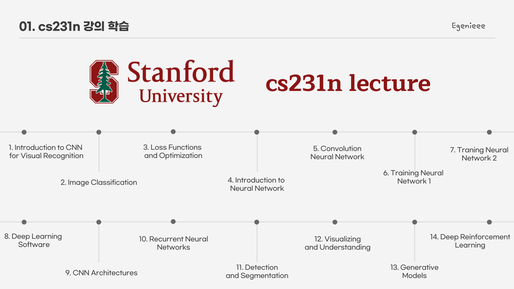
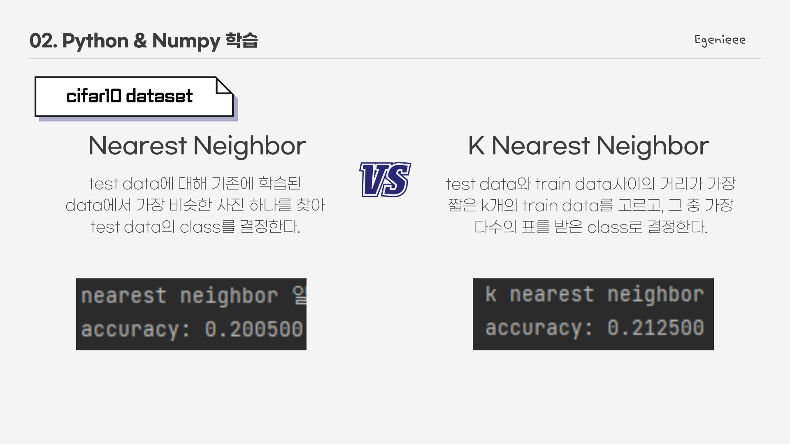
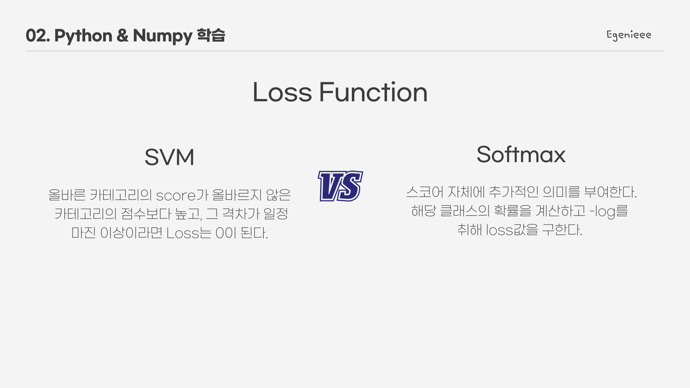
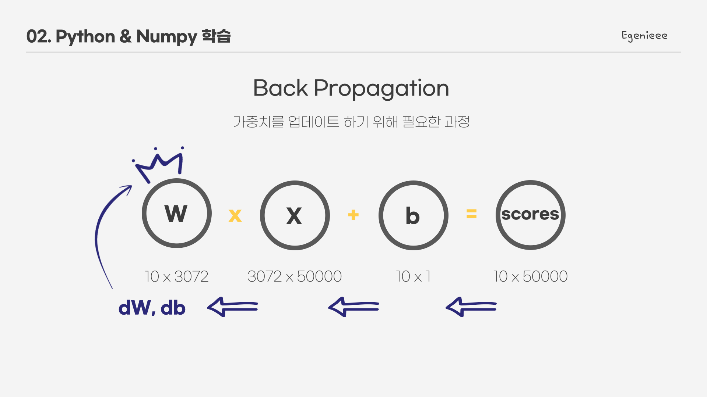
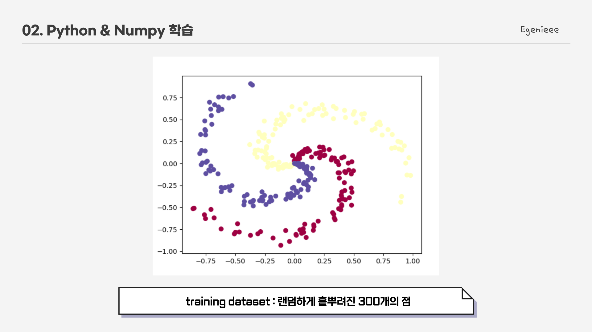
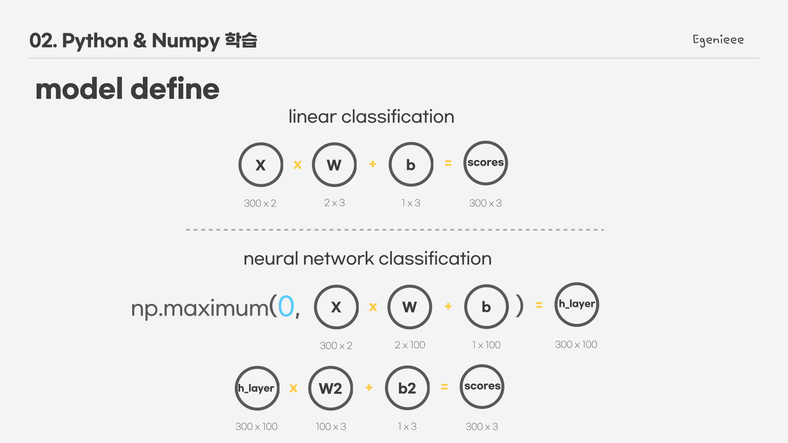
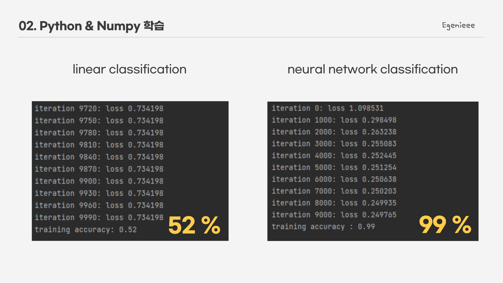
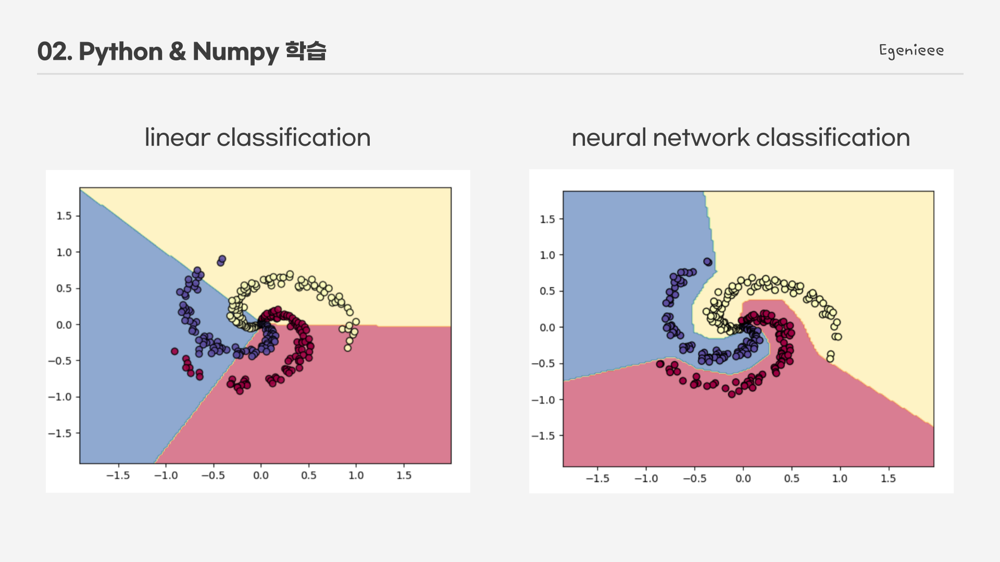

# cs231n-study
## Stanford University cs231n lecture

Deep Learning 강의 cs231n를 공부하면서 소스 코드 실습 및 직접 작성

### - cs231n 강의 목차

### - Nearest Neighbor VS K Nearest Neighbor

* 구현 file
>image_classification.py   
>nearest_neighbor.py   
>k_nearest_neighbor.py

### - Loss Function

* 구현 file 
>get_loss.py   
>loss_function.py

### - BackPropagation

* 구현 file 
>following_gradient.py  
>softmax_linear_cifar10.py

BackProp을 이용하여 가중치 W 업데이트

### - Linear Classification VS Neural Network Classification

300개의 점을 두 모델로 각각 분류해본다.

모델 구성은 위와 같다.

실행 결과

* 구현 file 
>following_gradient.py   
>softmax_linear_cifar10.py

***
#### 참고
* CS231n Syllabus : <http://cs231n.stanford.edu/2017/syllabus.html>   
* CS231n source code : <https://cs231n.github.io/>

